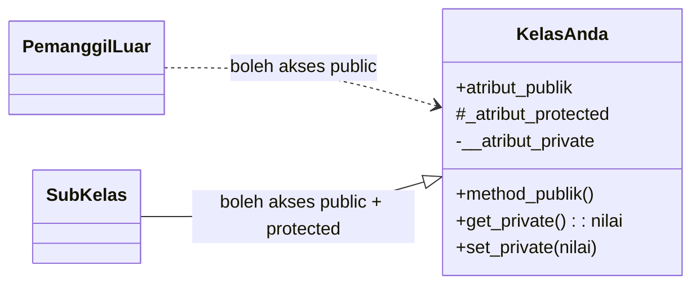

# Materi 04 — Enkapsulasi (Encapsulation)

---

## 1. Apa Itu Enkapsulasi?

**Enkapsulasi** adalah pilar pertama OOP yang paling fundamental. Terdiri dari dua ide utama:

1. **Membungkus (Encapsulate):** Data (atribut) dan perilaku (method) yang berhubungan digabung dalam satu unit kelas — sudah kita pelajari di Materi 02 & 03.
2. **Menyembunyikan (Information Hiding):** Menyembunyikan detail internal kelas dari dunia luar, dan hanya mengekspos apa yang memang perlu diketahui.

> *"Sembunyikan apa yang bisa berubah; tampilkan hanya apa yang stabil."*

### Mengapa Ini Penting?

Bayangkan sebuah ATM. Anda bisa melihat slot kartu, layar, dan tombol — itulah **antarmuka publik** (public interface). Anda *tidak* bisa melihat sirkuit di dalamnya, kabel, database bank — itulah **detail internal** yang tersembunyi.

Enkapsulasi yang baik memungkinkan:
- **Validasi data** — mencegah objek berada dalam keadaan tidak valid (ipk = -1, saldo = -9999)
- **Fleksibilitas** — implementasi internal bisa diganti tanpa merusak kode lain yang memakainya
- **Keamanan** — data sensitif tidak bisa diubah sembarangan dari luar

---

## 2. Tiga Tingkat Akses di Python

Python tidak memiliki *keyword* `private`/`public` seperti Java. Sebaliknya, Python menggunakan **konvensi penamaan** yang disepakati seluruh komunitas:

| Penulisan | Tingkat Akses | Makna |
|-----------|---------------|-------|
| `nama` | **Public** | Bisa diakses dari mana saja — oleh siapa saja |
| `_nama` | **Protected** | Konvensi: "hanya untuk dipakai internal kelas & subkelas" |
| `__nama` | **Private** | Python menyembunyikannya via *name mangling* |

> ⚠️ Python tidak *benar-benar* memblokir akses ke atribut `_` atau `__`. Ini adalah **konvensi** — perjanjian antar programmer. Python percaya pada *"we're all consenting adults here."*

> 💡 **Eksplorasi Langsung di Kode Praktik**
> File `kode/01_akses_modifier.py` mendemonstrasikan keempat konsep ini dengan contoh nyata:
> 1. **Bagian 1:** `KaryawanInfo` — membandingkan akses public, protected, dan private secara berdampingan.
> 2. **Bagian 2:** `AkunBank` + `__dict__` — melihat name mangling "dari dalam" dengan mencetak semua atribut.
> 3. **Bagian 3:** `Kendaraan` & `Mobil` — mengapa `_protected` masuk akal diakses oleh subkelas.
> 4. **Bagian 4:** `Induk` & `Anak` — membuktikan private mencegah konflik nama di pewarisan.
>
> *Jalankan file tersebut dan amati outputnya sebelum melanjutkan ke bagian berikutnya!*

### Contoh Perbandingan

```python
class AkunPengguna:
    def __init__(self, nama, email, password):
        self.nama      = nama      # PUBLIC   — boleh diakses bebas
        self._email    = email     # PROTECTED — untuk internal/subkelas
        self.__password = password  # PRIVATE   — tersembunyi via name mangling

akun = AkunPengguna("Budi", "budi@email.com", "rahasia123")

# Public — bisa diakses langsung
print(akun.nama)          # Budi

# Protected — bisa diakses, tapi konvensinya jangan dari luar
print(akun._email)        # budi@email.com  ← bisa, tapi melanggar konvensi!

# Private — tidak bisa diakses langsung
# print(akun.__password)  # → AttributeError: tidak ditemukan!

# Nama mangling: python mengubah __password menjadi _AkunPengguna__password
print(akun._AkunPengguna__password)  # rahasia123  <- bisa, tapi SANGAT tidak disarankan!
```

---

## 3. Name Mangling — Rahasia di Balik `__`

Ketika Python melihat atribut dengan dua underscore di depan (seperti `__password`), Python secara otomatis **mengubah namanya** menjadi `_NamaKelas__atribut`. Proses ini disebut **name mangling**.

```python
class Rekening:
    def __init__(self, saldo):
        self.__saldo = saldo   # Python menyimpannya sebagai _Rekening__saldo

rek = Rekening(1_000_000)

# Melihat semua atribut objek via __dict__
print(rek.__dict__)
# Output: {'_Rekening__saldo': 1000000}
# Perhatikan: kunci-nya adalah '_Rekening__saldo', BUKAN '__saldo'!

# Akses via name mangling (jalan darurat — JANGAN dalam kode nyata!)
print(rek._Rekening__saldo)  # 1000000

# Akses yang BENAR: melalui method yang disediakan kelas
```

**Mengapa didesain begini?** Name mangling mencegah *collision* nama di pewarisan (inheritance). Subkelas tidak akan secara tidak sengaja menimpa atribut private kelas induk.

---

## 4. Getter dan Setter Manual (Cara Lama)

Sebelum `@property`, programmer menggunakan method getter/setter secara eksplisit:

```python
class Mahasiswa:
    def __init__(self, nama, ipk):
        self.__nama = nama
        self.__ipk  = 0.0
        self.set_ipk(ipk)   # validasi sejak awal!

    # Getter — untuk membaca atribut private
    def get_nama(self):
        return self.__nama

    def get_ipk(self):
        return self.__ipk

    # Setter — untuk mengubah atribut private dengan validasi
    def set_ipk(self, nilai):
        if not (0.0 <= nilai <= 4.0):
            raise ValueError(f"IPK harus antara 0.0 dan 4.0, dapat: {nilai}")
        self.__ipk = nilai


mhs = Mahasiswa("Budi", 3.75)
print(mhs.get_nama())   # Budi
print(mhs.get_ipk())    # 3.75

mhs.set_ipk(3.90)       # OK
# mhs.set_ipk(5.0)      # → ValueError: IPK harus antara 0.0 dan 4.0
```

**Kekurangan cara ini:** kode menjadi "cerewet" — setiap akses atribut harus memanggil method `get_xxx()` dan `set_xxx()`. Python menyediakan solusi elegan: `@property`.

---

## 5. `@property` — Getter Elegan

Decorator `@property` mengubah sebuah method menjadi **atribut yang bisa dibaca** — tanpa perlu tanda kurung saat mengaksesnya. Ini membuat API kelas terasa alami seperti atribut biasa, tapi tetap melewati logika kode di dalamnya.

```python
class Mahasiswa:
    def __init__(self, nama, ipk):
        self.__nama = nama
        self.__ipk  = float(ipk)   # Simpan langsung — setter belum ada di contoh ini

    @property
    def nama(self):
        """Getter untuk nama mahasiswa."""
        return self.__nama

    @property
    def ipk(self):
        """Getter untuk IPK."""
        return self.__ipk


mhs = Mahasiswa("Budi", 3.75)

# Akses seperti atribut biasa — tidak perlu kurung!
print(mhs.nama)   # Budi   <- memanggil method nama() di balik layar
print(mhs.ipk)    # 3.75   <- memanggil method ipk() di balik layar

# Tidak bisa diubah (belum ada setter) — property hanya baca
# mhs.nama = "Andi"  # -> AttributeError: can't set attribute
```

---

## 6. `@nama.setter` — Setter dengan Validasi

Pasangkan setter ke property yang sudah ada untuk memungkinkan pengubahan nilai dengan validasi:

```python
class Mahasiswa:
    def __init__(self, nama, nim, ipk):
        self.__nama = ""
        self.__nim  = ""
        self.__ipk  = 0.0
        # Gunakan setter agar validasi berjalan sejak konstruktor
        self.nama   = nama
        self.nim    = nim
        self.ipk    = ipk

    # ── Property NAMA ──────────────────────────────────────
    @property
    def nama(self):
        return self.__nama

    @nama.setter
    def nama(self, nilai):
        nilai = nilai.strip().title()
        if len(nilai) < 2:
            raise ValueError("Nama terlalu pendek!")
        self.__nama = nilai

    # ── Property NIM ───────────────────────────────────────
    @property
    def nim(self):
        return self.__nim

    @nim.setter
    def nim(self, nilai):
        if not (isinstance(nilai, str) and nilai.isdigit() and len(nilai) == 7):
            raise ValueError(f"NIM harus 7 digit angka, dapat: '{nilai}'")
        self.__nim = nilai

    # ── Property IPK ───────────────────────────────────────
    @property
    def ipk(self):
        return self.__ipk

    @ipk.setter
    def ipk(self, nilai):
        if not isinstance(nilai, (int, float)):
            raise TypeError("IPK harus berupa angka!")
        if not (0.0 <= nilai <= 4.0):
            raise ValueError(f"IPK harus 0.0 - 4.0, dapat: {nilai}")
        self.__ipk = round(float(nilai), 2)

    # ── Property turunan (computed) ────────────────────────
    @property
    def predikat(self):
        """Computed property — dihitung dari ipk, tidak disimpan."""
        if self.__ipk >= 3.51: return "Cum Laude"
        if self.__ipk >= 3.01: return "Sangat Memuaskan"
        if self.__ipk >= 2.76: return "Memuaskan"
        if self.__ipk >= 2.00: return "Cukup"
        return "Di Bawah Standar"

    def __str__(self):
        return f"[{self.nim}] {self.nama} | IPK {self.ipk:.2f} ({self.predikat})"


# Penggunaan yang valid
mhs = Mahasiswa("budi santoso", "2301001", 3.75)  # nama akan di-title-case
print(mhs)                 # [2301001] Budi Santoso | IPK 3.75 (Cum Laude)
print(mhs.predikat)        # Cum Laude

# Update via setter (validasi otomatis berjalan)
mhs.ipk = 3.90
print(mhs)                 # [2301001] Budi Santoso | IPK 3.90 (Cum Laude)

# Validasi bekerja saat nilai tidak valid
try:
    mhs.ipk = 5.0          # ValueError!
except ValueError as e:
    print(f"Error: {e}")   # Error: IPK harus 0.0 - 4.0, dapat: 5.0
```

---

## 7. `@nama.deleter` — Logika saat `del`

Decorator `@nama.deleter` (di mana `nama` adalah nama *property*-nya) mendefinisikan logika saat atribut dihapus menggunakan `del`:

```python
class Sertifikat:
    def __init__(self, nomor, pemilik):
        self.__nomor   = nomor
        self.__pemilik = pemilik
        self.__valid   = True

    @property
    def nomor(self):
        return self.__nomor

    @property
    def pemilik(self):
        return self.__pemilik

    @pemilik.deleter
    def pemilik(self):
        """Saat pemilik dihapus, sertifikat menjadi tidak valid."""
        print(f"Sertifikat {self.__nomor} dicabut dari {self.__pemilik}!")
        self.__pemilik = None
        self.__valid   = False

    @property
    def valid(self):
        return self.__valid


sertif = Sertifikat("CERT-001", "Budi Santoso")
print(sertif.pemilik)   # Budi Santoso
print(sertif.valid)     # True

del sertif.pemilik      # Sertifikat CERT-001 dicabut dari Budi Santoso!
print(sertif.pemilik)   # None
print(sertif.valid)     # False
```

---

## 8. Property untuk Atribut Computed (Read-Only)

Property sangat berguna untuk atribut yang **dihitung dari atribut lain** — tidak perlu disimpan terpisah, selalu sinkron otomatis:

```python
class PersegiPanjang:
    def __init__(self, panjang, lebar):
        self.panjang = panjang   # setter dengan validasi
        self.lebar   = lebar

    @property
    def panjang(self):
        return self.__panjang

    @panjang.setter
    def panjang(self, nilai):
        if nilai <= 0:
            raise ValueError("Panjang harus positif!")
        self.__panjang = nilai

    @property
    def lebar(self):
        return self.__lebar

    @lebar.setter
    def lebar(self, nilai):
        if nilai <= 0:
            raise ValueError("Lebar harus positif!")
        self.__lebar = nilai

    # Computed properties — dihitung otomatis, selalu update
    @property
    def luas(self):
        return self.__panjang * self.__lebar

    @property
    def keliling(self):
        return 2 * (self.__panjang + self.__lebar)

    @property
    def diagonal(self):
        return (self.__panjang ** 2 + self.__lebar ** 2) ** 0.5


pp = PersegiPanjang(10, 5)
print(f"Luas    : {pp.luas}")       # 50
print(f"Keliling: {pp.keliling}")   # 30
print(f"Diagonal: {pp.diagonal:.2f}")  # 11.18

pp.panjang = 20   # ubah panjang
print(f"Luas baru: {pp.luas}")     # 100 — otomatis update!
```

> 💡 **Eksplorasi Lanjutan di Kode Praktik**
> File `kode/02_property.py` menghadirkan **4 contoh nyata** penggunaan `@property`:
> 1. **Bagian 1:** Kelas `Suhu` — `@property` untuk mengkonversi Celsius ke Fahrenheit dan Kelvin *secara otomatis*.
> 2. **Bagian 2:** Kelas `Mahasiswa` (4 atribut: nama, nim, ipk, semester) — validasi menyeluruh + computed `predikat` dan `tahun_masuk`.
> 3. **Bagian 3:** Kelas `Sesi` (login) — `@token.deleter` untuk pola logout yang aman.
> 4. **Bagian 4:** Kelas `Dokumen` — **Property Caching** (lihat bagian berikutnya!).
>
> *Sangat disarankan menjalankan file ini untuk melihat validasi bekerja secara live di terminal!*

---

## 9. Property Caching — Optimasi Komputasi Berat

Kadang sebuah `@property` memerlukan kalkulasi yang **mahal** (lambat). Daripada menghitung ulang setiap kali diakses, kita bisa menyimpan hasilnya di **cache** dan hanya menghitung ulang jika data sumbernya berubah.

```python
class Dokumen:
    """Dokumen teks dengan word-count yang dihitung sekali dan di-cache."""

    def __init__(self, judul, isi):
        self.__judul    = judul
        self.__isi      = isi
        self.__cache_wc = None   # cache dimulai kosong

    @property
    def judul(self):
        return self.__judul

    @property
    def isi(self):
        return self.__isi

    @isi.setter
    def isi(self, teks_baru):
        self.__isi      = teks_baru
        self.__cache_wc = None   # <-- cache di-invalidate saat isi berubah!

    @property
    def jumlah_kata(self):
        """Hitung kata hanya jika cache kosong atau isi berubah."""
        if self.__cache_wc is None:
            print("  [Menghitung word count...]")
            self.__cache_wc = len(self.__isi.split())
        return self.__cache_wc


dok = Dokumen("Pengantar Python", "Python adalah bahasa yang mudah dan kuat.")

print(dok.jumlah_kata)
# Output (2 baris):
#   [Menghitung word count...]
#   7

print(dok.jumlah_kata)
# Output (cache, langsung tanpa hitung ulang):
#   7

dok.isi = "Isi baru yang lebih pendek."
print(dok.jumlah_kata)
# Output (cache di-invalidate, hitung ulang):
#   [Menghitung word count...]
#   5
```

**Kenapa ini penting?** Cache mencegah kalkulasi ulang yang tidak perlu. Bayangkan jika `jumlah_kata` menghitung dari file 100MB — Anda pasti tidak mau menghitung ulang setiap kali `dok.jumlah_kata` dipanggil!

---

## 10. Studi Kasus Nyata — Enkapsulasi dalam Sistem Keuangan

Semua konsep yang telah kita pelajari berpadu dalam satu sistem nyata. Perhatikan kelas `RekeningBank`: **saldo tidak bisa diubah langsung dari luar**, setiap transaksi melewati validasi, dan riwayat dilindungi dari manipulasi.

```python
class RekeningBank:
    LIMIT_TARIK = 10_000_000   # atribut kelas (public constant)

    def __init__(self, pemilik, nomor_rekening, saldo_awal=0):
        self.__pemilik         = pemilik.strip().title()   # private
        self.__nomor_rekening  = nomor_rekening             # private
        self.__saldo           = 0.0                        # private
        self.__riwayat         = []                         # private
        self.__aktif           = True                       # private
        if saldo_awal > 0:
            self.__saldo = saldo_awal

    # --- Properties (read-only dari luar) ---
    @property
    def pemilik(self):
        return self.__pemilik

    @property
    def saldo(self):
        return self.__saldo   # tidak bisa di-set dari luar!

    @property
    def nomor_rekening(self):
        """Sensor: hanya tampilkan 4 digit terakhir."""
        return "****-****-" + self.__nomor_rekening[-4:]

    @property
    def bunga_bulanan(self):
        """Computed property: berhitung langsung dari saldo."""
        return round(self.__saldo * 3.5 / 100 / 12, 2)

    @property
    def riwayat(self):
        return self.__riwayat.copy()   # kembalikan SALINAN, bukan referensi asli!

    # --- Operasi yang mengubah saldo hanya melalui method resmi ---
    def setor(self, jumlah):
        if jumlah <= 0:
            raise ValueError("Jumlah setor harus positif!")
        self.__saldo += jumlah
        self.__riwayat.append(f"+Rp {jumlah:,.0f}")
        print(f"  [+] Setor Rp {jumlah:,.0f} | Saldo: Rp {self.__saldo:,.0f}")

    def tarik(self, jumlah):
        if jumlah > self.__saldo:
            raise ValueError(f"Saldo tidak cukup! Saldo: Rp {self.__saldo:,.0f}")
        if jumlah > self.LIMIT_TARIK:
            raise ValueError(f"Melebihi limit tarik Rp {self.LIMIT_TARIK:,.0f}!")
        self.__saldo -= jumlah
        self.__riwayat.append(f"-Rp {jumlah:,.0f}")
        print(f"  [-] Tarik Rp {jumlah:,.0f} | Saldo: Rp {self.__saldo:,.0f}")


rek = RekeningBank("budi santoso", "1234567890123456", saldo_awal=5_000_000)
rek.setor(1_500_000)
# Output:   [+] Setor Rp 1,500,000 | Saldo: Rp 6,500,000

rek.tarik(500_000)
# Output:   [-] Tarik Rp 500,000 | Saldo: Rp 6,000,000

# Saldo TIDAK bisa dimanipulasi langsung dari luar
# rek.__saldo = 999_999  # -> AttributeError (name mangling melindungi!)
print(f"Saldo aman: Rp {rek.saldo:,.0f}")
# Output: Saldo aman: Rp 6,000,000
```

**Mengapa `riwayat` mengembalikan `.copy()`?** Supaya kode luar tidak bisa mengubah isi list asli langsung — ini adalah contoh enkapsulasi yang sering terlewat oleh pemula!

> 💡 **Eksplorasi Lanjutan di Kode Praktik**
> File `kode/03_enkapsulasi_praktis.py` menghadirkan **2 studi kasus industri** yang lengkap:
> 1. **Studi Kasus 1: `RekeningBank`** — sistem keuangan dengan transfer antar rekening, riwayat transaksi, bunga bulanan, dan rollback otomatis jika transfer gagal.
> 2. **Studi Kasus 2: `Produk` (Inventori)** — manajemen stok produk dengan `status` computed (`HABIS`/`KRITIS`/`RENDAH`/`TERSEDIA`), pencatatan log penjualan, dan proteksi harga negatif.
>
> *File ini adalah demonstrasi terbaik mengapa enkapsulasi sangat penting dalam sistem produksi nyata!*

---

## 12. Pola Terbaik Enkapsulasi

### Kapan Gunakan Atribut Public vs Property?

| Skenario | Rekomendasi |
|----------|-------------|
| Data sederhana tanpa batasan | Atribut public (`self.nama`) |
| Data yang perlu validasi | Property + setter (`@property`) |
| Data sensitif (password, saldo) | Private + property getter saja |
| Nilai turunan/computed | Property getter saja (read-only) |

### Anti-Pattern yang Harus Dihindari

```python
# Anggap `ipk_baru` sudah didapat dari input pengguna
ipk_baru = 3.90

# ❌ BURUK: Validasi di luar kelas — tanggung jawab menyebar
mhs = Mahasiswa("Budi", "2301001", 3.00)
if 0 <= ipk_baru <= 4.0:              # logika validasi ada di sini (luar kelas!)
    mhs.ipk = ipk_baru

# ✅ BAIK: Validasi di dalam kelas — objek bertanggung jawab atas dirinya sendiri
mhs = Mahasiswa("Budi", "2301001", 3.00)
mhs.ipk = ipk_baru   # kelas yang akan memvalidasi, bukan pemanggilnya
```

---

## 13. Ringkasan Visual



**Tabel Ringkasan Konvensi:**

| Penulisan | Akses dari luar kelas | Akses dari subkelas | Name Mangling? |
|-----------|-----------------------|---------------------|----------------|
| `nama` | ✅ Bebas | ✅ Bebas | Tidak |
| `_nama` | ⚠️ Bisa, tapi jangan | ✅ Dianjurkan | Tidak |
| `__nama` | ❌ Tidak bisa langsung | ❌ Tidak bisa langsung | ✅ Ya: `_Kelas__nama` |

---

## 📖 Bacaan Lanjutan

- 🔗 [Real Python: Python Property](https://realpython.com/python-property/)
- 🔗 [Python Docs: property](https://docs.python.org/3/library/functions.html#property)
- 🔗 [PEP 8 — Naming Conventions](https://peps.python.org/pep-0008/#naming-conventions)

---

*➡️ Lanjut ke: [Materi 05 — Hubungan Kelas dan UML](../Materi_05_Hubungan_Kelas_dan_UML/materi.md)*
