# Materi 05 — Hubungan Kelas dan UML

---

## 1. Mengapa Butuh Lebih dari Satu Kelas?

Pada materi sebelumnya kita selalu bekerja dengan *satu kelas dalam satu waktu*. Namun di dunia nyata, sebuah sistem dibangun dari **banyak kelas yang saling berinteraksi**.

Bayangkan sistem akademik kampus:
- Seorang **Mahasiswa** mengambil banyak **Mata Kuliah**
- Setiap **Mata Kuliah** diajar oleh seorang **Dosen**
- **Dosen** terdaftar di sebuah **Jurusan**
- **Jurusan** memiliki banyak **Ruang Kelas**

Setiap baris di atas menggambarkan **hubungan (*relationship*)** antar kelas.

Di OOP, ada tiga jenis hubungan utama antar kelas:

| Jenis | Kata Kunci | Kekuatan | Contoh Nyata |
|-------|-----------|----------|-------------|
| **Asosiasi** | "menggunakan" | Lemah | Mahasiswa menggunakan Printer |
| **Agregasi** | "memiliki" | Sedang | Jurusan memiliki banyak Dosen |
| **Komposisi** | "terdiri dari" | Kuat | Rumah terdiri dari Kamar |

---

## 2. Asosiasi (Association)

**Asosiasi** adalah hubungan paling umum dan paling longgar. Objek A "mengenal" atau "menggunakan" objek B, tetapi **keduanya hidup secara independen** — satu bisa ada tanpa yang lain.

### Ciri-ciri Asosiasi:
- Objek B diterima sebagai **parameter** method, atau
- Dibuat sementara di dalam method, lalu dibuang
- Tidak ada "kepemilikan" — keduanya berdiri sendiri

### Contoh di Dunia Nyata:

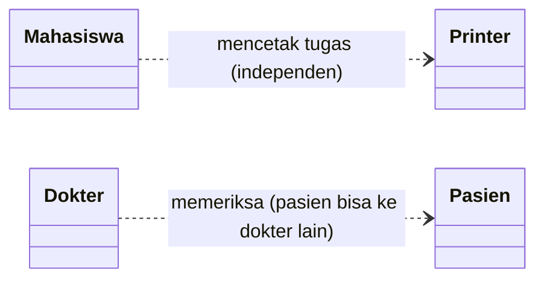

> **Kunci Asosiasi:** Objek B **tidak disimpan** sebagai atribut A. B hanya "dipakai sesaat" via parameter method.

### Implementasi Python:

> **Perhatikan:** `Printer` **tidak disimpan** sebagai atribut `self.printer` di dalam `Mahasiswa`. Ia hanya diterima sebagai parameter, digunakan sekali, lalu selesai. Itulah Asosiasi.

```python
class Printer:
    def __init__(self, merk, dpi):
        self.merk = merk
        self.dpi  = dpi

    def cetak(self, nama_file):
        print(f"  [{self.merk}] Mencetak '{nama_file}' @ {self.dpi} DPI ... OK")


class Mahasiswa:
    def __init__(self, nama, nim):
        self.nama = nama
        self.nim  = nim
        # Perhatikan: TIDAK ADA self.printer = ...
        # Itulah yang membedakan Asosiasi dari Agregasi!

    # Printer diterima sebagai PARAMETER — hubungan longgar
    def cetak_tugas(self, printer, nama_file):
        """Asosiasi: Printer diterima sebagai parameter, dipakai sementara."""
        print(f"  {self.nama} mengirim '{nama_file}' ke {printer.merk}...")
        printer.cetak(nama_file)


# Kedua objek dibuat secara INDEPENDEN
printer_lab = Printer("HP LaserJet Pro", 1200)
budi        = Mahasiswa("Budi Santoso", "2301001")

# Asosiasi terjadi saat method dipanggil
budi.cetak_tugas(printer_lab, "Laporan_PBO.pdf")
# Output: 
#   Budi Santoso mengirim 'Laporan_PBO.pdf' ke HP LaserJet Pro...
#   [HP LaserJet Pro] Mencetak 'Laporan_PBO.pdf' @ 1200 DPI ... OK

# Printer bisa digunakan oleh Mahasiswa lain
sari = Mahasiswa("Sari Dewi", "2301002")
sari.cetak_tugas(printer_lab, "UTS_Kalkulus.pdf")
# Output: 
#   Sari Dewi mengirim 'UTS_Kalkulus.pdf' ke HP LaserJet Pro...
#   [HP LaserJet Pro] Mencetak 'UTS_Kalkulus.pdf' @ 1200 DPI ... OK
```

### Diagram UML Asosiasi:

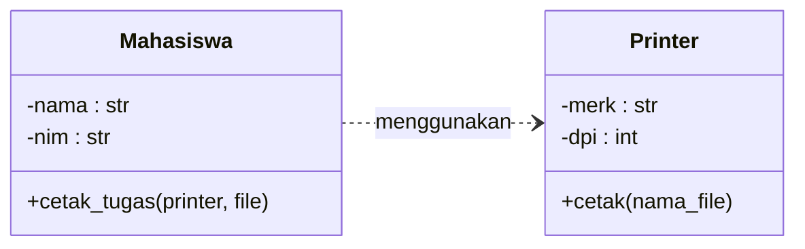

**Notasi:** `..>` (panah putus-putus — asosiasi/dependency searah)

> 💡 **Eksplorasi Lanjutan di Kode Praktik**
> File `kode/01_asosiasi.py` memberikan **3 contoh level Asosiasi** yang mendalam:
> 1. **Asosiasi Sederhana** (seperti di atas): `Mahasiswa` dan `Printer`.
> 2. **Asosiasi Dua Arah (*Bidirectional*)**: `Dokter` dan `Pasien` saling mencatat kunjungan/riwayat satu sama lain, namun tetap bisa hidup mandiri.
> 3. **Asosiasi dengan Multiplisitas (1-to-N)**: 1 `Dosen` mengajar banyak `MataKuliah`.
> 
> *Sangat disarankan untuk membuka dan menjalankan file tersebut!*

---

## 3. Agregasi (Aggregation)

**Agregasi** adalah hubungan "memiliki" yang lebih kuat dari asosiasi, tetapi masih **longgar dalam kepemilikan**. Objek B (*bagian*) **bisa hidup sendiri** tanpa objek A (*induk*).

### Ciri-ciri Agregasi:
- Objek bagian dibuat **di luar** objek induk
- Objek bagian **dikirim via konstruktor atau method**
- Jika objek induk dihapus, objek bagian **tetap hidup**

### Contoh di Dunia Nyata:

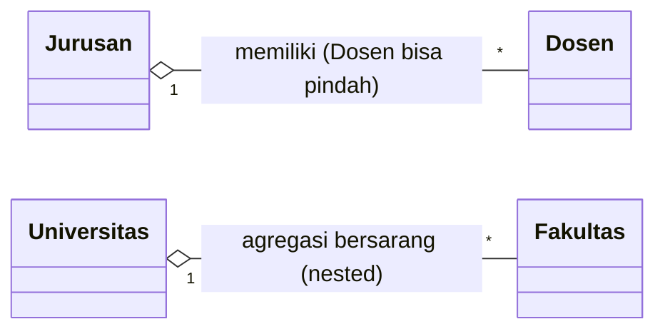

### Implementasi Python:

> **Perhatikan perbedaan krusial dari Asosiasi:** Di sini `self._dosen = []` ada di dalam `__init__` kelas `Jurusan`. Artinya Jurusan **menyimpan** referensi ke objek Dosen secara permanen — itulah Agregasi.

```python
class Dosen:
    def __init__(self, nama, nip, bidang_keahlian):
        self.nama            = nama
        self.nip             = nip
        self.bidang_keahlian = bidang_keahlian

    @property
    def info_singkat(self):
        return f"{self.nama} (Bid: {self.bidang_keahlian})"

    def __str__(self):
        return f"Dosen: {self.nama} | NIP: {self.nip} | Bidang: {self.bidang_keahlian}"


class Jurusan:
    def __init__(self, nama, kode):
        self.nama   = nama
        self.kode   = kode
        self._dosen = []   # <-- AGREGASI: menyimpan referensi ke Dosen dari luar

    def tambah_dosen(self, dosen):
        """Dosen DIKIRIM dari luar — Jurusan tidak membuat Dosen sendiri."""
        if isinstance(dosen, Dosen):
            self._dosen.append(dosen)
            print(f"  [+] {dosen.nama} bergabung ke Jurusan {self.nama}")

    def keluarkan_dosen(self, nip):
        """Menghapus referensi dosen dari jurusan, BUKAN menghapus objek."""
        before = len(self._dosen)
        self._dosen = [d for d in self._dosen if d.nip != nip]
        if len(self._dosen) < before:
            print(f"  [-] Dosen dengan NIP {nip} dikeluarkan dari {self.nama}")

    @property
    def jumlah_dosen(self):
        return len(self._dosen)

    def tampilkan(self):
        print(f"\n  Jurusan: {self.nama} ({self.kode})")
        print(f"  Jumlah Dosen: {self.jumlah_dosen}")
        for d in self._dosen:
            print(f"    - {d.info_singkat}")


# Dosen dibuat INDEPENDEN dari Jurusan
dosen1 = Dosen("Dr. Anton",   "NIP001", "Machine Learning")
dosen2 = Dosen("Dr. Budi",    "NIP002", "Network Security")
dosen3 = Dosen("Dr. Citra",   "NIP003", "Database Systems")

# Jurusan MEMILIKI dosen (agregasi)
jurusan_if = Jurusan("Informatika", "IF")
jurusan_if.tambah_dosen(dosen1)
# Output:   [+] Dr. Anton bergabung ke Jurusan Informatika
jurusan_if.tambah_dosen(dosen2)
# Output:   [+] Dr. Budi bergabung ke Jurusan Informatika

jurusan_si = Jurusan("Sistem Informasi", "SI")
jurusan_si.tambah_dosen(dosen3)

# Satu dosen BISA dimiliki dua jurusan sekaligus (double appointment)
jurusan_si.tambah_dosen(dosen1)

jurusan_if.tampilkan()
# Output:
#   Jurusan: Informatika (IF)
#   Jumlah Dosen: 2
#     - Dr. Anton (Bid: Machine Learning)
#     - Dr. Budi (Bid: Network Security)

jurusan_si.tampilkan()
# Output:
#   Jurusan: Sistem Informasi (SI)
#   Jumlah Dosen: 2
#     - Dr. Citra (Bid: Database Systems)
#     - Dr. Anton (Bid: Machine Learning)

# Demo: Membuktikan Agregasi dengan mengeluarkan dosen (dosen tetap ada di memori)
jurusan_if.keluarkan_dosen("NIP002")
# Output:   [-] Dosen dengan NIP NIP002 dikeluarkan dari Informatika

# Jika jurusan_if dihapus, dosen1 dan dosen2 MASIH ADA
del jurusan_if
print(f"\n  dosen1 masih ada: {dosen1}")
print(f"  dosen2 masih ada: {dosen2}")
# Output: 
#   dosen1 masih ada: Dosen: Dr. Anton | NIP: NIP001 | Bidang: Machine Learning
```

### Diagram UML Agregasi:

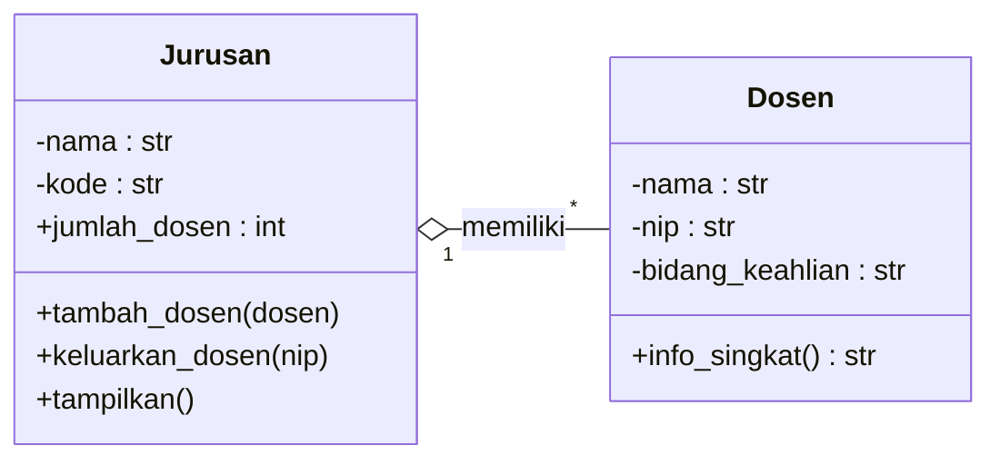

**Notasi:** `o--` (diamond kosong di sisi induk — agregasi)

> **Angka di garis UML:**
> - `1` = tepat satu
> - `*` = nol atau lebih (banyak)
> - `1..*` = satu atau lebih
> - `0..1` = nol atau satu (opsional)

> 💡 **Eksplorasi Lanjutan di Kode Praktik**
> File `kode/02_agregasi.py` di repositori ini memberikan **3 contoh penerapan Agregasi** yang lebih komprehensif:
> 1. **Agregasi Dasar** (seperti di atas): `Jurusan` mem-pool referensi banyak `Dosen`.
> 2. **Agregasi Bersarang (*Nested Aggregation*)**: Sebuah `Universitas` menampung `Fakultas`, yang di dalamnya menampung banyak `Jurusan`. Semua bagiannya *bisa dilepas / independen*.
> 3. **Benturan Agregasi & Asosiasi**: Kelas `ProyekRiset` meng-*agregasi* `Peneliti` (anggota yang hidup terpisah) sekaligus menggunakan `Lab` sesaat (*asosiasi*).
> 
> *Buka file tersebut untuk melihat penerapan di industri nyata!*

---

## 4. Komposisi (Composition)

**Komposisi** adalah hubungan "terdiri dari" yang **paling kuat**. Objek B (*bagian*) **tidak bisa hidup tanpa** objek A (*induk*). Objek bagian **dibuat oleh** objek induk dan **dihancurkan bersama** objek induk.

### Ciri-ciri Komposisi:
- Objek bagian dibuat **di dalam** objek induk (di konstruktor atau method internal)
- Jika objek induk dihapus, objek bagian **ikut musnah**
- Tidak ada berbagi objek bagian antar dua induk

### Contoh di Dunia Nyata:

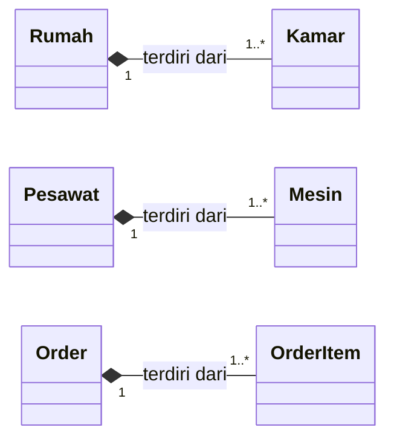

### Implementasi Python:

> **Kunci Komposisi:** Perhatikan baris `kamar_baru = Kamar(nomor, fungsi, luas_m2)` di dalam method `tambah_kamar()`. Objek `Kamar` dibuat **di dalam** `Rumah`, bukan dikirim dari luar. Tidak ada variabel lain di program ini yang memegang referensi ke objek `Kamar` tersebut.

```python
class Kamar:
    """Kamar tidak bisa hidup tanpa Rumah — ini adalah bagian dari Komposisi."""

    def __init__(self, nomor, fungsi, luas_m2):
        self.nomor   = nomor
        self.fungsi  = fungsi
        self.luas_m2 = luas_m2

    def __str__(self):
        return f"Kamar {self.nomor}: {self.fungsi} ({self.luas_m2} m2)"


class Rumah:
    """
    Rumah terdiri dari Kamar-kamar (Komposisi).
    Kamar dibuat DI DALAM Rumah dan hancur bersama Rumah.
    """

    def __init__(self, alamat, pemilik):
        self.alamat  = alamat
        self.pemilik = pemilik
        # Kamar dibuat LANGSUNG oleh Rumah — bukan dari luar
        self._kamar  = []

    def tambah_kamar(self, fungsi, luas_m2):
        """Rumah sendiri yang menciptakan Kamar baru."""
        nomor = len(self._kamar) + 1
        kamar_baru = Kamar(nomor, fungsi, luas_m2)   # <-- dibuat DI SINI
        self._kamar.append(kamar_baru)
        print(f"  [+] {kamar_baru} ditambahkan")
        return kamar_baru

    @property
    def total_luas(self):
        return sum(k.luas_m2 for k in self._kamar)

    @property
    def jumlah_kamar(self):
        return len(self._kamar)

    def tampilkan(self):
        print(f"\n  Rumah milik {self.pemilik} @ {self.alamat}")
        print(f"  Total luas: {self.total_luas} m2 | {self.jumlah_kamar} kamar")
        for k in self._kamar:
            print(f"    - {k}")


# Rumah membuat Kamar-nya sendiri (Komposisi)
rumah_budi = Rumah("Jl. Mulawarman No. 5, Samarinda", "Budi Santoso")
rumah_budi.tambah_kamar("Ruang Tamu",  25)
rumah_budi.tambah_kamar("Kamar Tidur Utama", 20)
rumah_budi.tambah_kamar("Kamar Tidur 2",     15)
rumah_budi.tambah_kamar("Dapur",       12)
rumah_budi.tambah_kamar("Kamar Mandi",  6)

rumah_budi.tampilkan()
# Output:
#   Rumah milik Budi Santoso @ Jl. Mulawarman No. 5, Samarinda
#   Total luas: 78 m2 | 5 kamar
#     - Kamar 1: Ruang Tamu (25 m2)
#     ...

# Saat rumah_budi dihapus, semua Kamar-nya ikut musnah
# (tidak ada referensi lain ke Kamar-kamar tersebut)
```

### Diagram UML Komposisi:

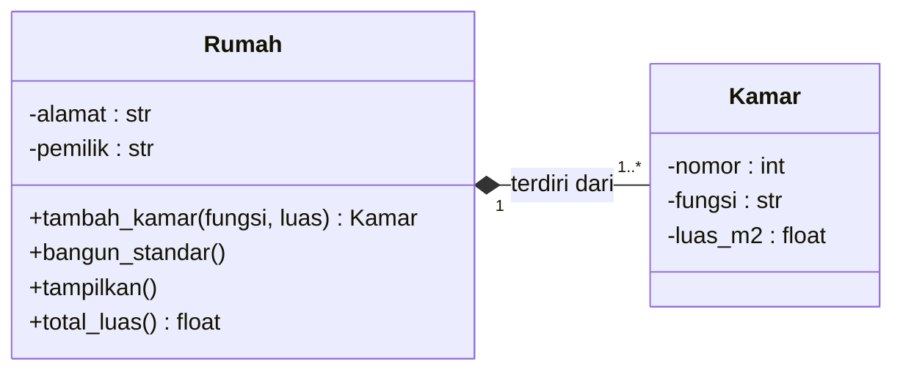

**Notasi:** `*--` (diamond terisi di sisi induk — komposisi)

---

## 5. Perbandingan Lengkap: Asosiasi vs Agregasi vs Komposisi

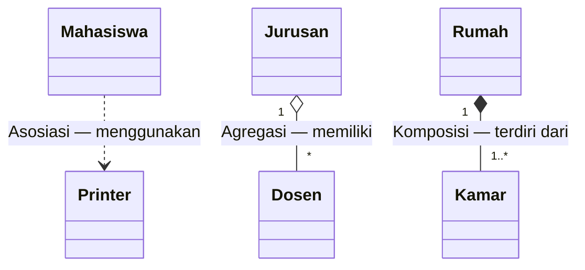

| Aspek | Asosiasi | Agregasi | Komposisi |
|-------|----------|----------|-----------|
| **Kata kunci** | "menggunakan" | "memiliki" | "terdiri dari" |
| **Dibuat di** | Luar, dikirim sbg parameter | Luar, dikirim ke method | **Dalam** objek induk |
| **Kepemilikan** | Tidak ada | Ya, bisa berbagi | Ya, eksklusif |
| **Hidup mandiri?** | Ya | Ya | Tidak |
| **Jika induk dihapus** | Bagian tetap ada | Bagian tetap ada | Bagian ikut musnah |
| **Notasi Mermaid** | `..>` | `o--` | `*--` |

---

## 6. Studi Kasus: Sistem Order Toko Online

Sekarang kita gabungkan ketiganya dalam satu sistem nyata. Bayangkan aplikasi toko online:

- **`Pelanggan`** sudah ada di database sebelum order dibuat → disimpan di `Order` sebagai atribut → **Agregasi**
- **`OrderItem`** hanya ada karena ada Order. Tidak ada order? Tidak ada OrderItem → **Komposisi**
- **`Kurir`** hanya dipakai sesaat saat pengiriman, bukan "milik" Order → **Asosiasi**

```python
# KOMPOSISI: Order terdiri dari OrderItem
# AGREGASI:  Order memiliki satu Pelanggan
# ASOSIASI:  Order menggunakan Kurir untuk pengiriman

class Pelanggan:
    """Pelanggan berdiri sendiri (eksis tanpa Order)."""
    def __init__(self, nama, email):
        self.nama  = nama
        self.email = email


class Produk:
    """Produk berdiri sendiri (eksis tanpa Order)."""
    def __init__(self, nama, harga):
        self.nama  = nama
        self.harga = harga


class OrderItem:
    """OrderItem tidak bisa eksis tanpa Order (Komposisi)."""
    def __init__(self, produk, qty):
        self.produk = produk
        self.qty    = qty

    @property
    def subtotal(self):
        return self.produk.harga * self.qty


class Kurir:
    """Kurir berdiri sendiri."""
    def __init__(self, nama, kode):
        self.nama = nama
        self.kode = kode

    def kirim(self, order_id, alamat):
        print(f"  [{self.kode}] Mengirim Order #{order_id} ke {alamat}")


class Order:
    _counter = 0

    def __init__(self, pelanggan, alamat_kirim):
        Order._counter += 1
        self.id           = Order._counter
        self.pelanggan    = pelanggan      # AGREGASI — Pelanggan dari luar
        self.alamat_kirim = alamat_kirim
        self._items       = []             # KOMPOSISI — items dibuat di dalam
        self._dikirim     = False

    def tambah_item(self, produk, qty):
        """Membuat OrderItem di dalam Order (Komposisi)."""
        item = OrderItem(produk, qty)
        self._items.append(item)

    @property
    def total(self):
        return sum(item.subtotal for item in self._items)

    def proses_pengiriman(self, kurir):
        """Menggunakan Kurir sebagai parameter (Asosiasi)."""
        kurir.kirim(self.id, self.alamat_kirim)
        self._dikirim = True

    def tampilkan(self):
        print(f"\n  Order #{self.id} — Pelanggan: {self.pelanggan.nama}")
        print(f"  Kirim ke: {self.alamat_kirim}")
        for item in self._items:
            print(f"    {item.produk.nama} x{item.qty} = Rp {item.subtotal:,.0f}")
        print(f"  TOTAL: Rp {self.total:,.0f}")
```

### Diagram UML Studi Kasus: Sistem Order Toko Online

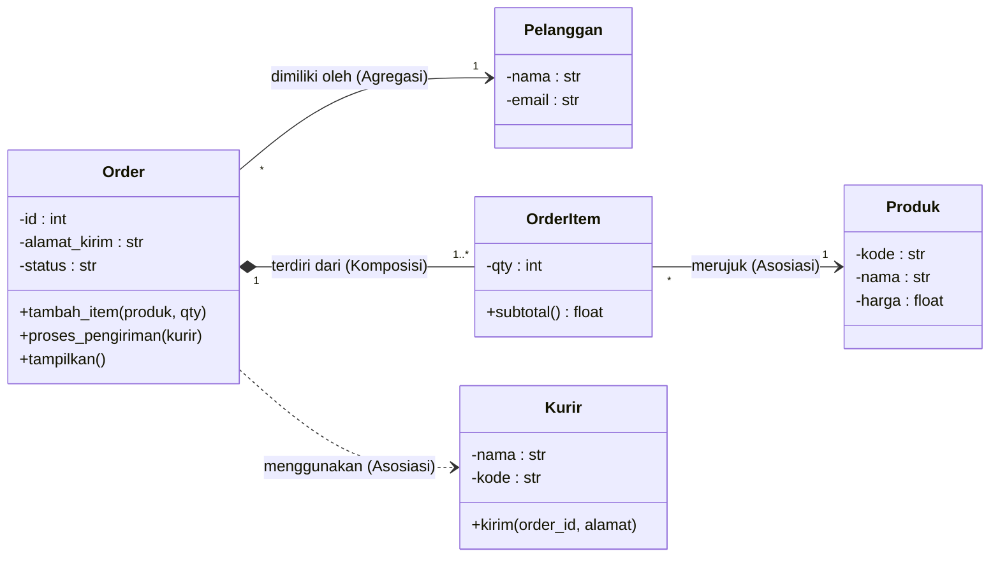

---

## 7. Panduan Singkat Diagram Kelas UML

Diagram Kelas UML adalah cara standar untuk menggambarkan struktur kelas secara visual sebelum menulis kode.

### Notasi Atribut dan Method dalam Mermaid:

| Simbol | Arti | Contoh |
|--------|------|--------|
| `-` | private | `-nama : str` |
| `#` | protected | `#_saldo : float` |
| `+` | public | `+tampilkan()` |
| `~` | package/internal | `~_helper()` |

### Notasi Hubungan (Mermaid `classDiagram`):

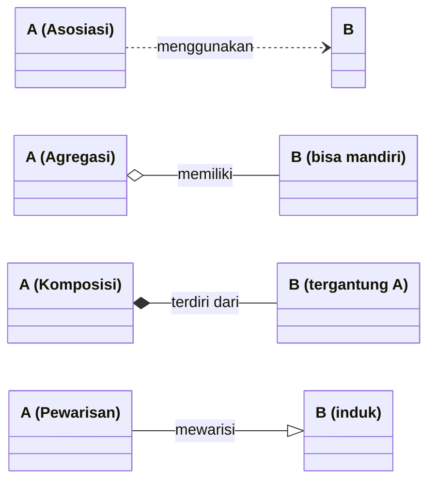

### Multiplisitas (angka di garis):

| Notasi | Arti |
|--------|------|
| `"1"` | Tepat satu |
| `"*"` | Nol atau lebih (banyak) |
| `"0..1"` | Opsional (nol atau satu) |
| `"1..*"` | Satu atau lebih |
| `"2..5"` | Antara dua sampai lima |

### Contoh: Diagram Kelas Sistem Akademik

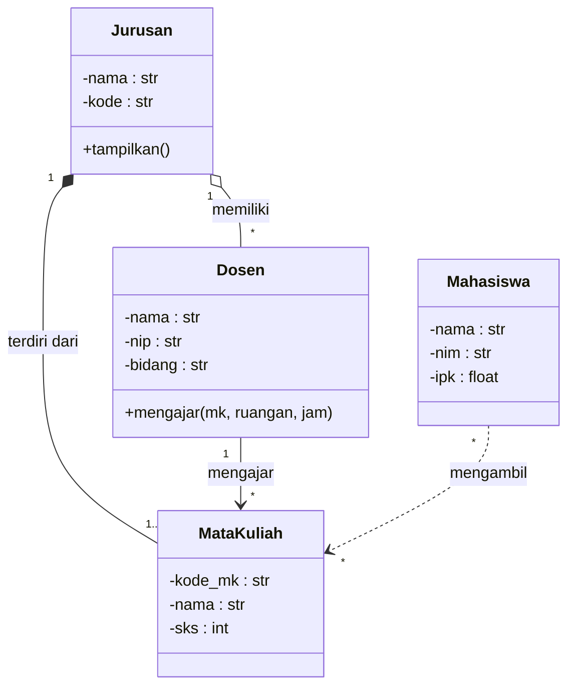

---

## 8. Tips Memilih Jenis Hubungan

Gunakan diagram keputusan berikut sebagai panduan:

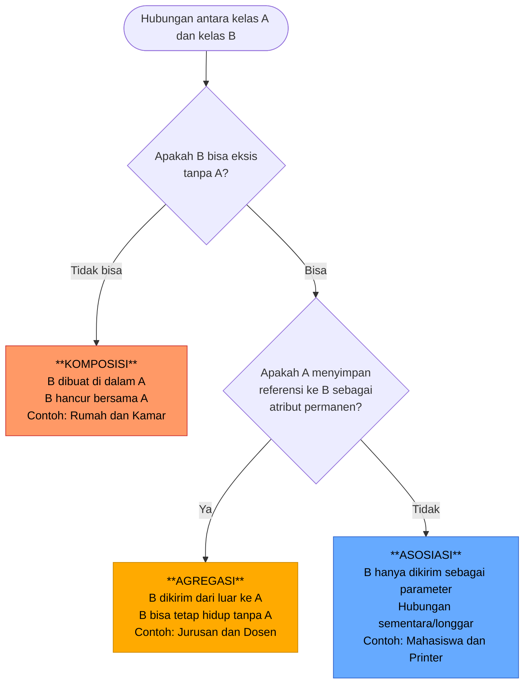

### Contoh Praktis:
| Skenario | Hubungan |
|---------|---------|
| Mahasiswa menggunakan Komputer di lab | Asosiasi |
| Universitas memiliki Mahasiswa (mahasiswa bisa pindah) | Agregasi |
| Laptop memiliki CPU (CPU tidak bisa lepas dari laptop) | Komposisi |
| Rumah sakit menggunakan Obat untuk treatment | Asosiasi |
| Apotek memiliki stok Obat | Agregasi |
| Resep terdiri dari Daftar Obat yang diresepkan | Komposisi |

---

## Bacaan Lanjutan

- [Real Python: Composition vs Inheritance](https://realpython.com/inheritance-composition-python/)
- [Python Docs: Classes](https://docs.python.org/3/tutorial/classes.html)
- [UML Class Diagram Tutorial — Visual Paradigm](https://www.visual-paradigm.com/guide/uml-unified-modeling-language/uml-class-diagram-tutorial/)

---

*Lanjut ke: [Materi 06 — Pewarisan (Inheritance)](../Materi_06_Pewarisan/materi.md)*
