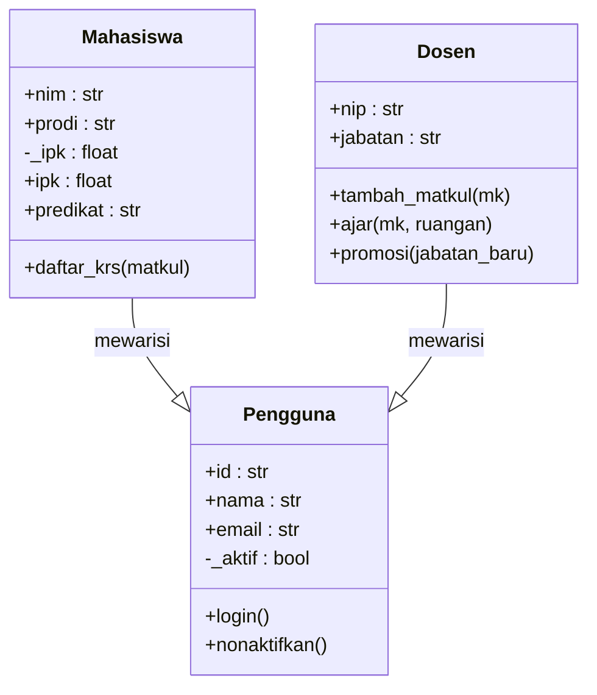

# Materi 06 — Pewarisan (Inheritance)

---

## 1. Apa Itu Pewarisan?

**Pewarisan** adalah pilar OOP kedua yang memungkinkan sebuah kelas **mewarisi atribut dan method** dari kelas lain. Kelas yang mewarisi disebut **kelas anak (child/subclass)**, dan kelas yang diwarisi disebut **kelas induk (parent/superclass)**.

> *"Jangan tulis ulang kode yang sudah ada — wariskan, lalu perluas."*

### Analogi Dunia Nyata

Bayangkan sebuah universitas. Ada data umum yang dimiliki **semua civitas akademika** (nama, ID, email). Namun seorang **mahasiswa** punya NIM dan IPK, sementara seorang **dosen** punya NIP dan jabatan. Alih-alih mendefinisikan ulang nama+email di setiap kelas, kita cukup mendefinisikannya **sekali** di kelas `Pengguna`, lalu `Mahasiswa` dan `Dosen` **mewarisinya**.

```
Pengguna  (induk)     →  nama, email, login()
├── Mahasiswa (anak)  →  mewarisi + tambah: nim, ipk, daftar_krs()
└── Dosen     (anak)  →  mewarisi + tambah: nip, jabatan, ajar()
```

### Manfaat Pewarisan:

- **Code Reuse** — tulis logika sekali, pakai di banyak kelas
- **Konsistensi** — semua anak punya antarmuka yang seragam dari induk
- **Mudah Diperluas** — tambah kelas baru tanpa menyentuh kelas yang sudah ada
- **Hierarki Alami** — mencerminkan struktur dunia nyata

---

## 2. Sintaks Dasar Pewarisan

```python
class Induk:
    """Kelas dasar (superclass)."""
    def __init__(self, nama):
        self.nama = nama

    def sapa(self):
        print(f"Halo, saya {self.nama}!")


class Anak(Induk):        # ← Anak mewarisi Induk
    """Kelas turunan (subclass)."""
    def __init__(self, nama, umur):
        super().__init__(nama)   # ← panggil konstruktor induk
        self.umur = umur

    def info(self):
        print(f"{self.nama}, {self.umur} tahun")


obj = Anak("Budi", 20)
obj.sapa()    # Halo, saya Budi!   ← method DIWARISI dari Induk
obj.info()    # Budi, 20 tahun     ← method MILIK Anak sendiri
```

**Fungsi `super()`** sangat penting — ia merujuk ke kelas induk sehingga kita bisa memanggil konstruktor atau method induk tanpa menyebutkan nama kelasnya secara eksplisit.

---

## 3. Fungsi `super()` — Jembatan ke Induk

`super()` digunakan untuk mengakses method atau konstruktor dari kelas induk. Ini penting agar tidak perlu menulis ulang logika konstruktor.

```python
class Pengguna:
    def __init__(self, nama, email):
        self.nama  = nama
        self.email = email
        self._aktif = True

    def login(self):
        print(f"  [{self.nama}] Login berhasil.")

    def logout(self):
        print(f"  [{self.nama}] Logout.")

    def __str__(self):
        return f"{self.nama} <{self.email}>"


class Mahasiswa(Pengguna):
    def __init__(self, nama, email, nim, ipk=0.0):
        super().__init__(nama, email)   # ← panggil __init__ Pengguna
        self.nim = nim
        self.ipk = ipk

    def daftar_krs(self, matkul):
        print(f"  [{self.nim}] {self.nama} mendaftar KRS: {matkul}")

    def __str__(self):
        return f"Mahasiswa({self.nim}) - {super().__str__()}"
        #                                 ↑ memanggil __str__ milik Pengguna


class Dosen(Pengguna):
    def __init__(self, nama, email, nip, jabatan="Asisten Ahli"):
        super().__init__(nama, email)
        self.nip     = nip
        self.jabatan = jabatan

    def ajar(self, matkul, ruangan):
        print(f"  [{self.nip}] {self.nama} mengajar {matkul} di {ruangan}")

    def __str__(self):
        return f"Dosen({self.jabatan}) - {super().__str__()}"


# Penggunaan
mhs = Mahasiswa("Budi Santoso", "budi@unmul.ac.id", "2301001", 3.75)
dos = Dosen("Dr. Anton",       "anton@unmul.ac.id", "NIP001", "Lektor")

mhs.login()              # method DIWARISI dari Pengguna
mhs.daftar_krs("PBO")   # method MILIK Mahasiswa
print(mhs)               # Mahasiswa(2301001) — Budi Santoso <budi@unmul.ac.id>

dos.login()              # method DIWARISI dari Pengguna
dos.ajar("PBO", "Lab 2")
print(dos)               # Dosen(Lektor) — Dr. Anton <anton@unmul.ac.id>
```

---

## 4. Method Overriding — Mendefinisikan Ulang Perilaku

Kelas anak bisa **menimpa (override)** method yang diwarisi dari induk untuk menyesuaikan perilakunya. Ini adalah dasar dari **Polimorfisme** (Materi 07).

```python
class Hewan:
    def __init__(self, nama):
        self.nama = nama

    def suara(self):
        # Method induk — bersifat umum/default
        return "..."

    def info(self):
        print(f"{self.nama} bersuara: {self.suara()}")


class Anjing(Hewan):
    def suara(self):        # ← OVERRIDE method suara()
        return "Guk! Guk!"


class Kucing(Hewan):
    def suara(self):        # ← OVERRIDE method suara()
        return "Meow!"


class Sapi(Hewan):
    def suara(self):        # ← OVERRIDE method suara()
        return "Moo!"


hewan_list = [Anjing("Rex"), Kucing("Kitty"), Sapi("Moo-moo")]

for h in hewan_list:
    h.info()
# Output:
# Rex bersuara: Guk! Guk!
# Kitty bersuara: Meow!
# Moo-moo bersuara: Moo!
```

### Override + Perluas dengan `super()`

Kadang kita ingin **menambah** logika ke method induk, bukan menggantinya sepenuhnya:

```python
class Karyawan:
    def __init__(self, nama, gaji):
        self.nama  = nama
        self.gaji  = gaji

    def info(self):
        print(f"  {self.nama} | Gaji: Rp {self.gaji:,.0f}")


class Manajer(Karyawan):
    def __init__(self, nama, gaji, bonus):
        super().__init__(nama, gaji)
        self.bonus = bonus

    def info(self):
        super().info()   # ← jalankan info() milik Karyawan dulu
        print(f"  Bonus : Rp {self.bonus:,.0f}")
        print(f"  Total : Rp {self.gaji + self.bonus:,.0f}")


mgr = Manajer("Siti", 12_000_000, 3_000_000)
mgr.info()
# Output:
#   Siti | Gaji: Rp 12,000,000
#   Bonus : Rp 3,000,000
#   Total : Rp 15,000,000
```

> 💡 **Eksplorasi Langsung di Kode Praktik**
> File `kode/01_pewarisan_dasar.py` mendemonstrasikan konsep ini secara mendalam:
> 1. **Bagian 1:** Hierarki `Pengguna → Mahasiswa / Dosen` — `super()` dan override `__str__`.
> 2. **Bagian 2:** Hierarki `Hewan → Anjing / Kucing / Sapi` — method override dan polimorfisme awal.
> 3. **Bagian 3:** Hierarki `Karyawan → Manajer / Direktur` — override + `super()` untuk memperluas perilaku.
>
> *Jalankan dan amati output setiap bagian sebelum melanjutkan!*

---

## 5. Tiga Pola Pewarisan di Python

### a) Single Inheritance — Paling Umum

Satu anak, satu induk. Pola yang paling mudah dipahami dan paling sering digunakan.

```
Pengguna
└── Mahasiswa
```

### b) Multilevel Inheritance — Rantai Pewarisan

Kelas anak mewarisi dari kelas anak lain — membangun rantai hierarki:

```
Hewan
└── Mamalia
    └── Primata
        └── Manusia
```

```python
class Hewan:
    def __init__(self, nama):
        self.nama = nama

    def bernafas(self):
        print(f"  {self.nama} bernafas.")


class Mamalia(Hewan):
    def menyusui(self):
        print(f"  {self.nama} menyusui anaknya.")


class Primata(Mamalia):
    def menggunakan_tangan(self):
        print(f"  {self.nama} menggunakan tangan untuk alat.")


class Manusia(Primata):
    def __init__(self, nama, pekerjaan):
        super().__init__(nama)
        self.pekerjaan = pekerjaan

    def berbicara(self):
        print(f"  {self.nama} berbicara tentang {self.pekerjaan}.")


budi = Manusia("Budi", "pemrograman")
budi.bernafas()             # Diwarisi dari Hewan
budi.menyusui()             # Diwarisi dari Mamalia
budi.menggunakan_tangan()   # Diwarisi dari Primata
budi.berbicara()            # Milik Manusia sendiri
```

### c) Multiple Inheritance — Dua Induk Sekaligus

Satu kelas mewarisi dari **dua atau lebih** kelas induk sekaligus:

```python
class BisaTerbang:
    def terbang(self):
        print(f"  {self.nama} terbang di udara!")


class BisaBerenang:
    def renang(self):
        print(f"  {self.nama} berenang di air!")


class Bebek(BisaTerbang, BisaBerenang):
    def __init__(self, nama):
        self.nama = nama

    def quack(self):
        print(f"  {self.nama}: Kwek kwek!")


donald = Bebek("Donald")
donald.terbang()   # Dari BisaTerbang
donald.renang()    # Dari BisaBerenang
donald.quack()     # Milik Bebek
```

> ⚠️ **Hati-hati Multiple Inheritance!** Jika dua induk punya method dengan nama yang sama, Python akan memilih yang pertama dalam urutan deklarasi. Gunakan `NamaKelas.__mro__` untuk melihat urutan penyelesaian (*Method Resolution Order*).

---

## 6. Method Resolution Order (MRO)

Saat ada multiple inheritance, Python menentukan urutan pencarian method menggunakan algoritma **C3 Linearization**. Urutan ini disebut **MRO**.

```python
class A:
    def hello(self):
        print("Halo dari A")

class B(A):
    def hello(self):
        print("Halo dari B")

class C(A):
    def hello(self):
        print("Halo dari C")

class D(B, C):   # D mewarisi B dan C
    pass


d = D()
d.hello()   # Output: Halo dari B  ← B ditemukan lebih dulu

# Lihat urutan MRO:
print(D.__mro__)
# (<class 'D'>, <class 'B'>, <class 'C'>, <class 'A'>, <class 'object'>)
# Urutan pencarian: D → B → C → A → object
```

---

## 7. Mixin — Pewarisan Modular

**Mixin** adalah kelas kecil yang dirancang khusus untuk **ditambahkan** ke kelas lain via multiple inheritance — bukan berdiri sendiri. Mixin menyediakan fitur tambahan tanpa harus membangun hierarki yang dalam.

```python
class JSONMixin:
    """Mixin: tambahkan kemampuan serialisasi JSON ke kelas apapun."""
    def to_json(self):
        import json
        return json.dumps(self.__dict__, default=str, ensure_ascii=False, indent=2)


class LogMixin:
    """Mixin: tambahkan kemampuan logging ke kelas apapun."""
    def log(self, pesan):
        from datetime import datetime
        waktu = datetime.now().strftime("%H:%M:%S")
        print(f"  [{waktu}] [{self.__class__.__name__}] {pesan}")


class ValidasiMixin:
    """Mixin: tambahkan validasi umum."""
    @staticmethod
    def wajib_isi(nilai, nama_field):
        if not nilai or not str(nilai).strip():
            raise ValueError(f"Field '{nama_field}' tidak boleh kosong!")
        return str(nilai).strip()


# Gabungkan Mixin sesuai kebutuhan
class Mahasiswa(JSONMixin, LogMixin, ValidasiMixin):
    def __init__(self, nama, nim, ipk):
        self.nama = self.wajib_isi(nama, "nama")
        self.nim  = nim
        self.ipk  = ipk

    def update_ipk(self, ipk_baru):
        ipk_lama  = self.ipk
        self.ipk  = ipk_baru
        self.log(f"IPK diperbarui: {ipk_lama} -> {ipk_baru}")


mhs = Mahasiswa("Budi Santoso", "2301001", 3.75)
mhs.update_ipk(3.90)
# Output: [22:30:15] [Mahasiswa] IPK diperbarui: 3.75 -> 3.90

print(mhs.to_json())
# Output:
# {
#   "nama": "Budi Santoso",
#   "nim": "2301001",
#   "ipk": 3.9
# }
```

> 💡 **Eksplorasi Lanjutan di Kode Praktik**
> File `kode/02_pola_pewarisan.py` mendemonstrasikan semua pola pewarisan secara mendalam:
> 1. **Bagian 1:** Multilevel Inheritance — hierarki `Kendaraan → Mobil → Sedan`.
> 2. **Bagian 2:** Multiple Inheritance — `BisaTerbang`, `BisaBerenang`, `BisaLari` digabung ke `Itik`.
> 3. **Bagian 3:** MRO — demonstrasi urutan pencarian method dengan `__mro__`.
> 4. **Bagian 4:** Mixin — `JSONMixin`, `LogMixin`, dan `ValidasiMixin` diterapkan ke sistem nyata.
>
> *Sangat disarankan menjalankan file ini untuk melihat bagaimana Python menyelesaikan method antar kelas!*

---

## 8. Fungsi Bawaan untuk Pewarisan: `isinstance()` dan `issubclass()`

Python menyediakan dua fungsi built-in yang sangat berguna saat bekerja dengan hierarki kelas:

```python
class Hewan:   pass
class Anjing(Hewan):  pass
class Pudel(Anjing):  pass

pudel = Pudel()

# isinstance: apakah objek adalah instance dari kelas (termasuk kelas induknya)?
print(isinstance(pudel, Pudel))    # True  ← langsung
print(isinstance(pudel, Anjing))   # True  ← karena Pudel mewarisi Anjing
print(isinstance(pudel, Hewan))    # True  ← karena Anjing mewarisi Hewan
print(isinstance(pudel, int))      # False

# issubclass: apakah sebuah kelas merupakan subclass dari kelas lain?
print(issubclass(Pudel, Anjing))   # True
print(issubclass(Pudel, Hewan))    # True  ← transitif
print(issubclass(Anjing, Pudel))   # False ← bukan sebaliknya!
print(issubclass(Hewan, object))   # True  ← semua kelas mewarisi object
```

### Penggunaan Praktis: Validasi tipe input

```python
def tampilkan_info_hewan(hewan):
    if not isinstance(hewan, Hewan):
        raise TypeError(f"Butuh objek Hewan, dapat: {type(hewan).__name__}")
    print(f"Ini adalah {type(hewan).__name__}: {hewan.nama}")
```

---

## 9. Studi Kasus Nyata — Sistem Akademik

Semua konsep berpadu dalam satu sistem akademik yang realistis:

```python
class Pengguna:
    jumlah_pengguna = 0

    def __init__(self, nama, email):
        Pengguna.jumlah_pengguna += 1
        self.id     = f"USR-{Pengguna.jumlah_pengguna:04d}"
        self.nama   = nama.strip().title()
        self.email  = email.lower()
        self._aktif = True

    @property
    def aktif(self):
        return self._aktif

    def nonaktifkan(self):
        self._aktif = False
        print(f"  [{self.id}] {self.nama} dinonaktifkan.")

    def login(self):
        if not self._aktif:
            print(f"  [X] Akun {self.nama} tidak aktif!")
            return
        print(f"  [OK] {self.nama} ({self.id}) berhasil login.")

    def __str__(self):
        status = "Aktif" if self._aktif else "Nonaktif"
        return f"[{self.id}] {self.nama} | {self.email} | {status}"


class Mahasiswa(Pengguna):
    def __init__(self, nama, email, nim, prodi):
        super().__init__(nama, email)
        self.nim    = nim
        self.prodi  = prodi
        self._ipk   = 0.0
        self._skripsi_selesai = False

    @property
    def ipk(self):
        return self._ipk

    @ipk.setter
    def ipk(self, nilai):
        if not (0.0 <= nilai <= 4.0):
            raise ValueError(f"IPK tidak valid: {nilai}")
        self._ipk = round(nilai, 2)

    @property
    def predikat(self):
        if self._ipk >= 3.51: return "Cum Laude"
        if self._ipk >= 3.01: return "Sangat Memuaskan"
        if self._ipk >= 2.76: return "Memuaskan"
        return "Cukup"

    def daftar_krs(self, daftar_matkul):
        print(f"  [{self.nim}] {self.nama} - KRS:")
        for mk in daftar_matkul:
            print(f"    - {mk}")

    def selesaikan_skripsi(self):
        self._skripsi_selesai = True
        print(f"  [S] {self.nama} telah menyelesaikan skripsi!")

    def __str__(self):
        return (f"Mahasiswa | {super().__str__()} | "
                f"NIM: {self.nim} | IPK: {self._ipk:.2f} ({self.predikat})")


class Dosen(Pengguna):
    def __init__(self, nama, email, nip, jabatan="Asisten Ahli"):
        super().__init__(nama, email)
        self.nip      = nip
        self.jabatan  = jabatan
        self._matkul  = []

    def tambah_matkul(self, matkul):
        self._matkul.append(matkul)
        print(f"  [{self.nip}] {self.nama} ditugaskan mengajar: {matkul}")

    def ajar(self, matkul, ruangan):
        if matkul not in self._matkul:
            print(f"  [!] {matkul} bukan matkul {self.nama}!")
            return
        print(f"  [~] {self.nama} mengajar {matkul} di {ruangan}")

    def promosi(self, jabatan_baru):
        print(f"  [*] {self.nama}: {self.jabatan} -> {jabatan_baru}")
        self.jabatan = jabatan_baru

    def __str__(self):
        return (f"Dosen | {super().__str__()} | "
                f"NIP: {self.nip} | Jabatan: {self.jabatan}")


# ── Penggunaan ──────────────────────────────────────────────────────
mhs1 = Mahasiswa("budi santoso", "budi@unmul.ac.id", "2301001", "Informatika")
mhs1.ipk = 3.85
mhs1.login()
mhs1.daftar_krs(["PBO", "Basis Data", "Kalkulus"])

dos1 = Dosen("dr. anton prafanto", "anton@unmul.ac.id", "NIP001", "Lektor")
dos1.tambah_matkul("PBO")
dos1.ajar("PBO", "Lab Pemrograman 2")
dos1.promosi("Lektor Kepala")

print()
print(mhs1)
print(dos1)
print(f"\nTotal pengguna: {Pengguna.jumlah_pengguna}")
```

> 💡 **Eksplorasi Lanjutan di Kode Praktik**
> File `kode/03_studi_kasus.py` menghadirkan **sistem lengkap dengan 2 skenario nyata**:
> 1. **Skenario 1:** Sistem Akademik — `Pengguna → Mahasiswa / Dosen / Admin`, termasuk verifikasi login, manajemen matkul, dan promosi jabatan.
> 2. **Skenario 2:** Sistem Rental Kendaraan — `Kendaraan → Mobil / Motor / Truk`, termasuk perhitungan biaya sewa, biaya per-km untuk truk, dan manajemen ketersediaan armada.
>
> *File ini adalah demonstrasi terbaik bagaimana pewarisan hidup dalam kode sistem nyata!*

---

## 10. Kapan Gunakan Pewarisan vs Komposisi?

Ini adalah pertanyaan desain yang paling sering muncul:

| Pertanyaan | Jawaban → Gunakan |
|---|---|
| Apakah hubungannya **"adalah sebuah"** (is-a)? | **Pewarisan**: `Mahasiswa` *adalah* `Pengguna` |
| Apakah hubungannya **"memiliki sebuah"** (has-a)? | **Komposisi**: `Order` *memiliki* `OrderItem` |
| Apakah kelas anak perlu **antarmuka yang sama** dengan induk? | **Pewarisan** |
| Apakah ingin **mengubah perilaku** tanpa memodifikasi hierarki? | **Komposisi** |

### Anti-Pattern yang Harus Dihindari

```python
# [BURUK]: Mewarisi hanya untuk "mendapatkan" method — hubungan tidak alami
class Stack(list):    # Stack "adalah" list? <- Tidak selalu tepat!
    def push(self, item):
        self.append(item)

# [LEBIH BAIK]: Stack "memiliki" list secara internal (Komposisi)
class Stack:
    def __init__(self):
        self._data = []

    def push(self, item):
        self._data.append(item)

    def pop(self):
        return self._data.pop()
```

---

## 11. Ringkasan Visual



**Tabel Ringkasan:**

| Konsep | Sintaks | Keterangan |
|--------|---------|------------|
| Deklarasi anak | `class Anak(Induk):` | Induk di dalam kurung |
| Panggil konstruktor induk | `super().__init__(...)` | Wajib jika anak punya `__init__` |
| Override method | Definisikan ulang di kelas anak | Nama method sama |
| Perluas method induk | `super().nama_method()` di dalam override | Jalankan dulu milik induk |
| Cek keanggotaan | `isinstance(obj, Kelas)` | Termasuk kelas leluhur |
| Cek hierarki | `issubclass(Anak, Induk)` | Transitif ke atas |
| Lihat MRO | `Kelas.__mro__` | Urutan pencarian method |

---

## 📖 Bacaan Lanjutan

- 🔗 [Real Python: Inheritance and Composition](https://realpython.com/inheritance-composition-python/)
- 🔗 [Python Docs: Classes — Inheritance](https://docs.python.org/3/tutorial/classes.html#inheritance)
- 🔗 [Python Docs: super()](https://docs.python.org/3/library/functions.html#super)
- 🔗 [PEP 3119 — Abstract Base Classes](https://peps.python.org/pep-3119/)

---

*➡️ Lanjut ke: [Materi 07 — Polimorfisme](../Materi_07_Polimorfisme/materi.md)*
